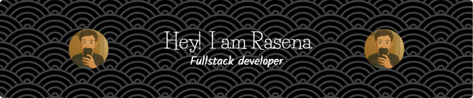

# Hi There 👋

<!--
**Rasenpai/Rasenpai** is a ✨ _special_ ✨ repository because its `README.md` (this file) appears on your GitHub profile.

Here are some ideas to get you started:

- 🔭 I’m currently working on ...
- 🌱 I’m currently learning ...
- 👯 I’m looking to collaborate on ...
- 🤔 I’m looking for help with ...
- 💬 Ask me about ...
- 📫 How to reach me: ...
- 😄 Pronouns: ...
- ⚡ Fun fact: ...
-->

### 💫 About Me:
#### Hi, I'm Rasena! I want to become a full-stack developer. I usually work with HTML, CSS, JS, Python, and some cool frameworks like React, Tailwind, Node, and Flask.

Besides that, I'm also really enthusiastic about AI and love exploring new technologies. My focus is on web development, and I’m always learning to improve my skills in the world of coding and technology.

### 🌐 Socials:
   

### 💻 Tech Stack:
   

### 🚀 Frameworks & Library:
   

### 📊 GitHub Stats:
 
 

### 🏆 GitHub Trophies

---

<!-- Proudly created with GPRM ( https://gprm.itsvg.in ) -->

### 🎮 Play game with me

<picture>
  <source media="(prefers-color-scheme: dark)" srcset="https://raw.githubusercontent.com/Rasenpai/Rasenpai/output/pacman-contribution-graph-dark.svg">
  <source media="(prefers-color-scheme: light)" srcset="https://raw.githubusercontent.com/Rasenpai/Rasenpai/output/pacman-contribution-graph.svg">
  
</picture>

###
